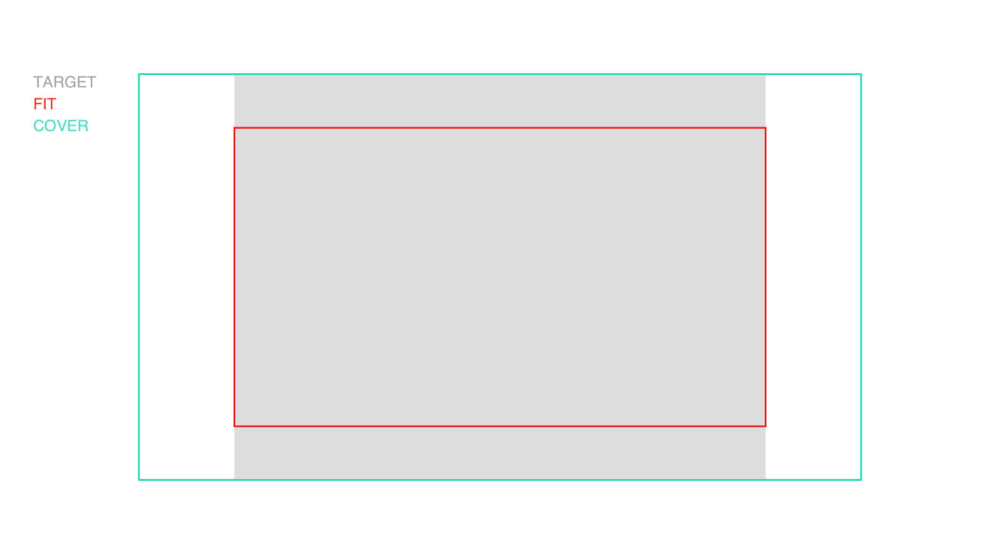

# fit-rect



[](http://github.com/badges/stability-badges)

Fits one rectangle into another

## Usage

[](https://www.npmjs.com/package/fit-rect)

```typescript
fitRect(rect: Size, target: Rect, mode: FitMode): Rect
```

##### Parameters:

- `rect` - array [ w, h ] or [ x, y, w, h ]
- `target` - array [ w, h ] or [ x, y, w, h ]
- `mode` - string 'contain' (default) or 'cover'

##### Returns:

- array [ x, y, w, h ]

```typescript
import { fitRect } from "fit-rect";

const rect = [16, 9];
const target = [200, 200, 400, 400];
const containedRect = fitRect(rect, target, "contain"); //[ 200, 287.5, 400, 225 ]
const coveringRect = fitRect(rect, target, "cover"); //[ 44.4, 200, 711.1, 400 ]
```

## License

MIT, see [LICENSE.md](http://github.com/vorg/fit-rect/blob/master/LICENSE.md) for details.
